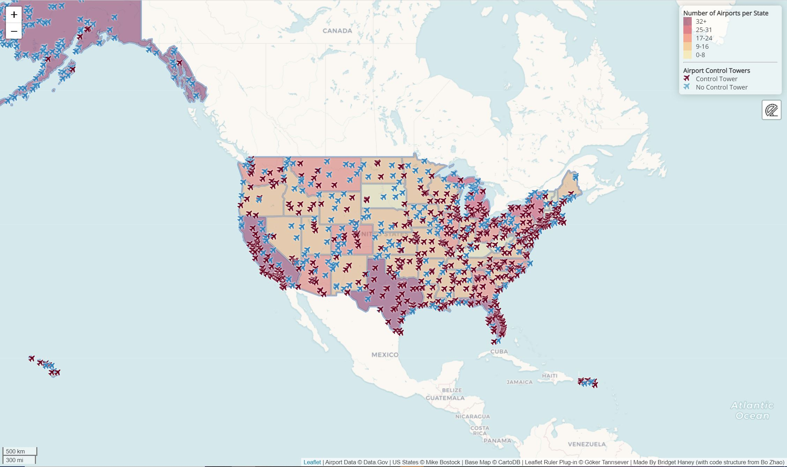

# Map of Airports in the United States

### Control Towers or No Towers?

#### Introduction

This choropleth map displays over 950 airports across the United States. They are scattered across the continental United States, . 

#### How to Use and Read the Map

On the interactive Leaftlet map, which is accessible from https://bridgethaney.github.io/Airport_Control_Map/, there are two kinds of airports that are displayed. The red plane symbol represents airports with control towers. The blue airplane symbol represents airports without control towers. When clicking on the airport markers, the name of the selected airport is shown through a popup. This allows users to specifically find out which airports do or do not have control towers. Along with this, there is noticeable ruler icon to the right of the map directly below the legend. This is an added ruler plug-in, which was created by Göker Tanrısever, that allows for distance measurements between selected points. Click on the ruler icon and then place a point anywhere on the map. From there, drag anywhere to see the distance in km. To exit out of this feature, double tap the escape button and the ruler will close.

As for the legend, there are two main sections that are present: number of airports in each state and airport control towers. The color of each state reflects the number of airports within state boundaries. For instance, South Dakota has 7 airports, so it is placed in the light yellow 0-8 category. Florida, on the other hand, has 38 airports, so it is placed in the dark red 32+ category. The higher the number of airports a state has, the darker the color it is given.

#### Analysis

I was surprised to see several hundred airports without a control tower. This is seemingly hazardous, as there is not proper focus being placed on air traffic. It is especially apparent in Alaska how many airports exist without control towers. Perhaps the number of planes going to and from the airports at a given time, as well as the trajectory of each flight plays a role in whether control towers are necessary. 

#### Credit

<b>US States Boundaries:</b> [] by Mike Bostock

<b>Leaflet Ruler Plug-In (Bonus Points):</b> [Leaflet Ruler](https://github.com/gokertanrisever/leaflet-ruler) by Göker Tanrısever in collaboration with Dmitriy Zaporozhets

